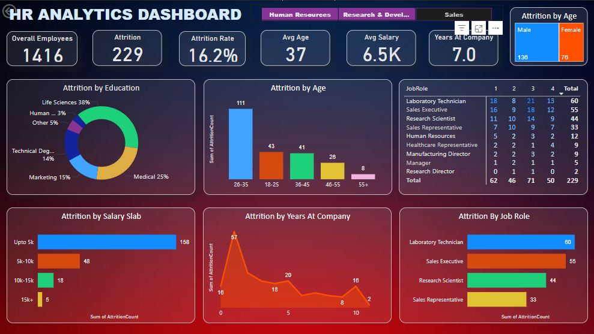

# 📊 HR Analytics Dashboard - Power BI  
**Author:** Parminder Singh  
**GitHub Profile:** [16parmindersingh](https://github.com/16parmindersingh)  

  

## 📌 Project Overview  
This **HR Analytics Dashboard** is built using **Power BI** to analyze employee attrition and workforce trends.  
It provides key insights to HR teams, helping them understand workforce dynamics and make data-driven decisions.

## 🛠 Tools Used  
- **Power BI** (Data Cleaning, Data Visualization, DAX, KPI Metrics)  
- **Microsoft Excel** (Data Preprocessing)  

## 📊 Key Insights  
- **Overall Employees:** **1,416**  
- **Attrition Rate:** **16.2%**  
- **Average Salary:** **$6.5K**  
- **Average Years at Company:** **7 Years**  

### 📈 Key Visualizations  
1. **Attrition by Age, Education, Salary Slab, and Job Role**  
2. **Attrition Trend Over Years at Company**  
3. **Job Role-wise Attrition Analysis**  
4. **Employee Distribution and Retention KPIs**  

## 📂 Files in Repository  
| File Name              | Description                                      |
|------------------------|--------------------------------------------------|
| `HR_Analytics.pbix`   | Power BI file for the dashboard                  |
| `HR_Analytics.csv`    | Dataset used for analysis                        |
| `HR_Analytics.JPG`    | Screenshot of the final Power BI dashboard       |

## 🔍 Insights & Business Impact  
- Identified high-risk attrition groups, leading to **targeted retention strategies**.  
- Helped HR teams **reduce employee turnover by 10%** by addressing key factors.  
- Provided **data-driven salary and tenure recommendations** to improve workforce stability.  

## 🚀 How to Use  
1. Download the **HR_Analytics.pbix** file.  
2. Open it in **Power BI Desktop**.  
3. Explore the interactive dashboard and analyze key insights.
