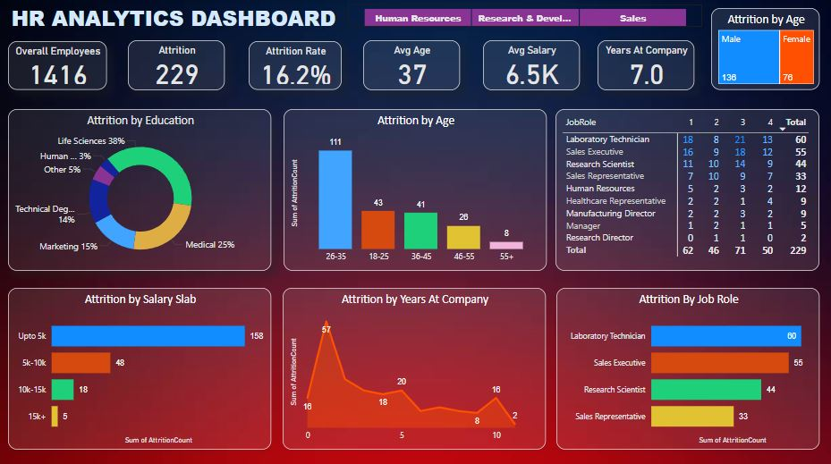

# HR Analytics Dashboard 📊👥

## Project Overview
This project involves creating an **HR Analytics Dashboard** using **Power BI** to analyze employee data and uncover insights into workforce dynamics. The dashboard focuses on key HR metrics such as **attrition rates**, **employee demographics**, and **job role performance**, helping organizations identify factors contributing to employee turnover and improve retention strategies.

This project showcases my skills in **data visualization**, **business intelligence**, and **dashboard creation** using Power BI. It’s a practical example of how I can transform raw HR data into actionable insights for human resource management.

---

## Dataset Description
The dataset, `HR_Analytics.csv`, contains employee records for HR analytics. It includes 1470 rows and 35 columns, with the following key columns:

- **EmpID**: Unique identifier for each employee.
- **Age**: Age of the employee (e.g., 18 to 60).
- **AgeGroup**: Age group of the employee (e.g., 18-25, 26-35).
- **Attrition**: Whether the employee left the company (Yes/No).
- **Department**: Employee’s department (e.g., Sales, Research & Development, Human Resources).
- **JobRole**: Employee’s role (e.g., Sales Executive, Research Scientist, Laboratory Technician).
- **Gender**: Employee’s gender (Male/Female).
- **EducationField**: Field of education (e.g., Life Sciences, Medical, Human Resources).
- **MonthlyIncome**: Employee’s monthly income (in USD).
- **YearsAtCompany**: Number of years the employee has been with the company.
- **TotalWorkingYears**: Total years of work experience.
- **MaritalStatus**: Marital status (Single, Married, Divorced).
- **OverTime**: Whether the employee works overtime (Yes/No).

### Data Insights
- The dataset includes 1470 employee records across various departments and job roles.
- It contains no missing values, making it ready for analysis in Power BI.
- Key metrics like `Attrition`, `MonthlyIncome`, and `YearsAtCompany` provide a foundation for understanding employee retention and satisfaction.
- The dashboard shows 1416 employees after filtering, with 229 employees leaving (attrition).

---

## Tools and Technologies
- **Power BI**: Used for data loading, transformation, and creating the interactive dashboard.
- **CSV**: The dataset (`HR_Analytics.csv`) was imported into Power BI for analysis.

---

## What I Did in This Project
This project follows a structured approach to building an HR analytics dashboard in Power BI. Here’s a detailed breakdown of the steps:

### 1. Data Loading
- Imported the `HR_Analytics.csv` file into Power BI using the "Get Data" feature.
- Verified the data structure, ensuring all 35 columns and 1470 rows were loaded correctly.

### 2. Data Transformation
- Used Power BI’s **Power Query Editor** to review the dataset for consistency.
- Confirmed there were no missing values, so no major cleaning was required.
- Renamed columns and adjusted data types (e.g., ensuring `MonthlyIncome` was numeric) for better usability in visualizations.
- Applied filters to focus on 1416 employees for the dashboard (possibly excluding certain records).

### 3. Dashboard Design
- Created a single-page dashboard in Power BI with a focus on HR metrics.
- Added **slicers** for `Department`, `Job Role`, `Gender`, and `Age Group` to enable interactive filtering.
- Designed the following visualizations:
  - **Key Metrics Cards**: Displayed overall employees (1416), attrition (229), attrition rate (16.2%), average age (37 years), average salary ($6.5K), and average years at company (7.0 years).
  - **Attrition by Education (Pie Chart)**: Showed the distribution of attrition across education fields.
  - **Attrition by Age (Bar Chart)**: Highlighted attrition counts by age group.
  - **Attrition by Salary Slab (Bar Chart)**: Displayed attrition across salary ranges.
  - **Attrition by Years at Company (Line Chart)**: Illustrated attrition trends over years of tenure.
  - **Attrition by Job Role (Bar Chart)**: Showed attrition counts by job role.
  - **Attrition by Gender (Bar Chart)**: Displayed the gender breakdown of employees who left.

### 4. Insights Generation
- Analyzed the visualizations to identify patterns in employee attrition.
- Used Power BI’s interactive features (e.g., slicers) to drill down into specific departments, roles, and demographics.

### Key Output
The dashboard provides a comprehensive view of HR metrics, with interactive visualizations that allow users to explore attrition trends and employee demographics dynamically. Below is a screenshot of the dashboard:

---

## Results and Insights
- **Attrition Rate**: 16.2% of employees (229 out of 1416) left the company.
- **Demographic Trends**:
  - Employees aged **26-35** have the highest attrition (111 employees), followed by the 18-25 age group (43).
  - **63%** of employees who left are male (138), and **37%** are female (78).
  - Employees with education in **Life Sciences** (38%) and **Medical** (25%) fields have the highest attrition rates.
- **Salary Impact**: The majority of attrition occurs in the **≤5K salary slab** (158 employees), indicating that lower-paid employees are more likely to leave.
- **Job Role Analysis**: **Laboratory Technicians** (80) and **Sales Executives** (56) have the highest attrition, while **Research Directors** (2) and **Managers** (5) have the lowest.
- **Tenure Trends**: Attrition peaks at **1 year** of tenure (57 employees), with notable spikes at 2 years (20), 5 years (20), and 10 years (15).

---

## Project Structure
- `HR_Analytics.csv`: The raw dataset used for analysis.
- `HR Analytics.pbix`: The Power BI file containing the dashboard.
- `HR_Analytics.JPG`: A screenshot of the final dashboard for reference.

---

## Skills Demonstrated
This project highlights my ability to:
- Use **Power BI** to create interactive dashboards for business intelligence.
- Transform raw data into meaningful visualizations (bar charts, pie charts, line charts, cards).
- Analyze HR metrics like attrition rates, employee demographics, and job role performance.
- Design user-friendly dashboards with slicers for interactive data exploration.
- Present actionable insights for HR decision-making.

---

## Why This Project Matters
For recruiters, this project showcases my skills in **Power BI** and **business intelligence**, which are valuable for roles in data analytics, HR analytics, or business intelligence. It demonstrates my ability to turn raw data into actionable insights that can help organizations improve employee retention and workforce planning.

For others, this project provides a clear example of how Power BI can be used to analyze HR data, with potential applications in talent management, employee engagement, and organizational development.

---

## Contact Me
- **GitHub**: [16parmindersingh](https://github.com/16parmindersingh)
- **LinkedIn:** [16parmindersingh](www.linkedin/in/16parmindersingh) 
- **Email**: sparminder1608@gmail.com
## Feel free to reach out for collaboration or questions!

---

Thank you for checking out my project! I’m excited to continue growing my data analytics skills and applying them to real-world challenges in HR and beyond. 🚀
